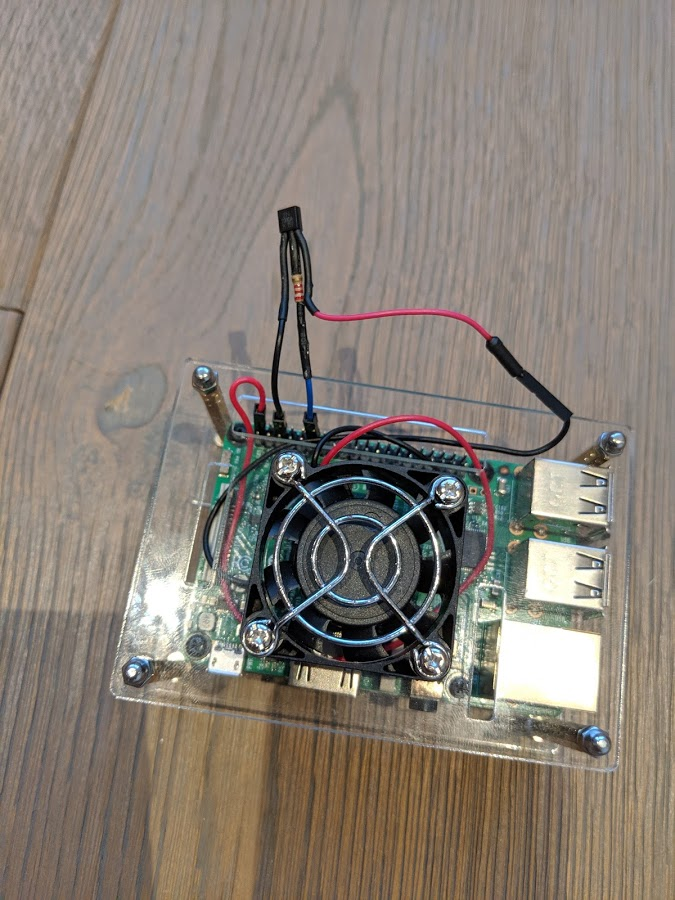
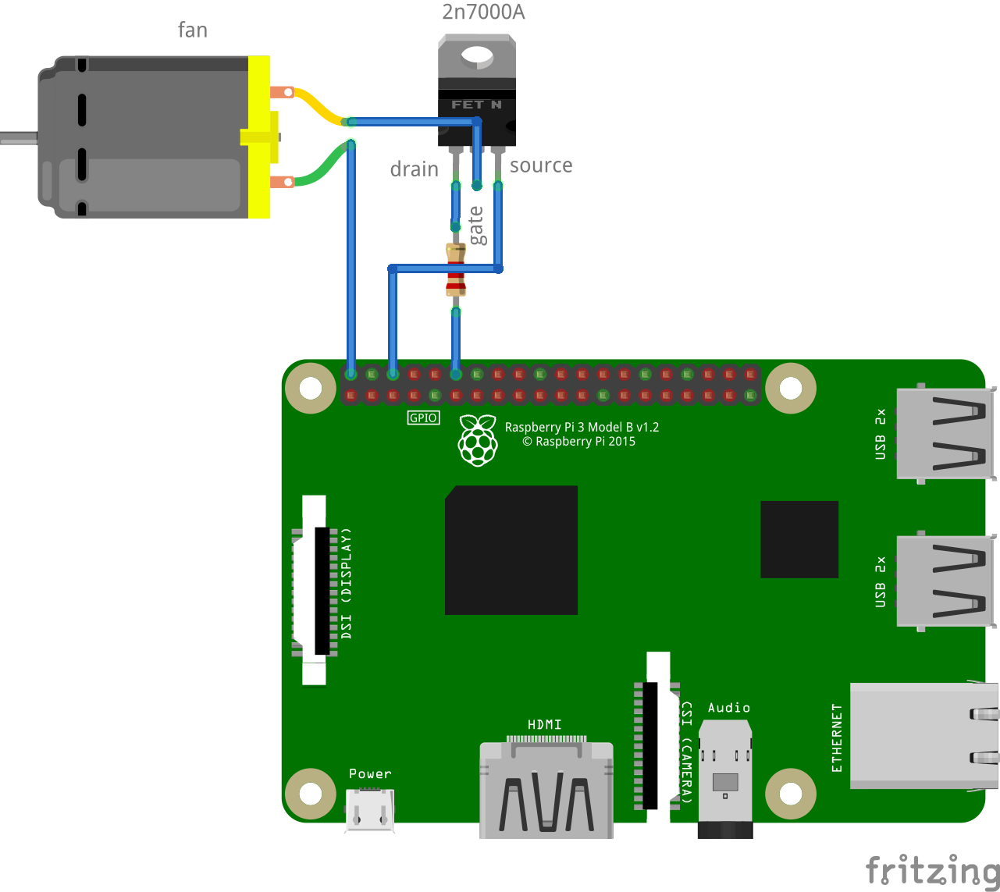

# Overview

Monitor raspberry pi's temperature and cool when needed.  The project
uses a small fan for the raspberry pi mounted on an acrylic case.



## Wiring

The raspberry pi's output pins can't be used to drive a small fan directly.
We can use an NPN mosfet to create a simple switch or driver for the fan.
I got some inspiration from [this page](https://www.electronics-tutorials.ws/transistor/tran_7.html).
The gate of the mosfet is connected through a 2.2k resistor to pin 1 (or GPIO18)
of the RPi.


The pin numbering can be a bit confusing on the RPi, but this page can provide some
clarity: [WiringPi pin numbering](http://wiringpi.com/pins/).

## Software

We're going to need the `gpio` command line tool, so we'll need to install
[WiringPI](http://wiringpi.com/download-and-install/)

With this in place you can now:

```
# set pin 1 mode to output
gpio mode 1 out
# turn pin 1 ON
gpio write 1 1
```

This should effectively turn on your fan.

We can read the RPi's CPU temperature using:
`/opt/vc/bin/vcgencmd measure_temp`

The script at [tempmon.sh](./tempmon.sh) ties things together.  It reads the
temperature and when it's above `$max` it starts cooling, when it's below
`$min` it stops.

You can schedule the whole thing through cron to have it automated.  Add a line similar to the one below to your crontab:
`* * * * * /bin/bash -c "/home/pi/bin/tempmon.sh"`
This monitors the temperature and manages the fan every minute.

## Components

* Acrylic casing and fan for raspberry pi (Aliexpress)
* Mosfet: 2N7000A
* 2.2k resistor